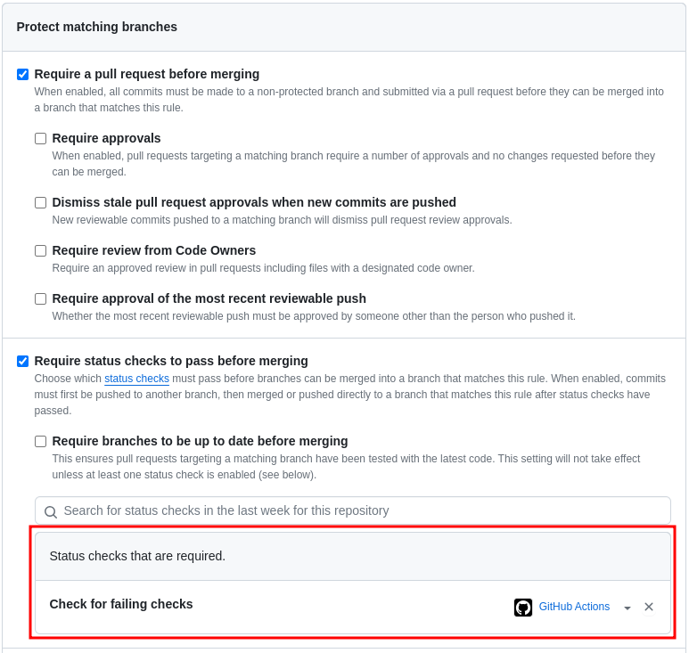

# How-to for a single required check

The Github guidance for [handling skipped but required checks](https://docs.github.com/en/pull-requests/collaborating-with-pull-requests/collaborating-on-repositories-with-code-quality-features/troubleshooting-required-status-checks#handling-skipped-but-required-checks) is really not helpful.

A different mechanism is to have _only_ one required check. It's purpose is to
confirm that the other checks on the PR were successful.

1. Have a [workflow](.github/workflows/check-checks.yml) that looks at all the checks on the current PR, and sets it's
   status based on the outcomes of the other checks.

2. Confirm there is only one required check:

    Settings -> Branches

    

3. Other checks in the repo can use the [usual filtering mechanisms](https://github.com/jsimpson-gro/workflows/blob/8782a01cbe908b0fdeea4d88ee9f3707ebe39916/.github/workflows/check-rust-files.yml#L3-L4) to execute
   selectively against the PRs where they have meaning.

## Examples

This repository has 7 workflows:
- [Check the checks](.github/workflows/check-checks.yml) - the only `Required` check.
- ['Check' Bash files](.github/workflows/check-bash-files.yml)
- ['Check' Go files](.github/workflows/check-go-files.yml)
- ['Check' Java files](.github/workflows/check-java-files.yml)
- ['Check' Python files](.github/workflows/check-python-files.yml)
- ['Check' Rust files](.github/workflows/check-rust-files.yml)
- ['Check' SQL files](.github/workflows/check-sql-files.yml)

Only the first is required.

- A [PR](https://github.com/jsimpson-gro/workflows/pull/10) with both Rust and Python changes. The Python check is failing, so
  the 'Check checks' is failing, so the merge is blocked.
- A [PR](https://github.com/jsimpson-gro/workflows/pull/14) with a successful SQL change.
- A [PR](https://github.com/jsimpson-gro/workflows/pull/13) with Bash, SQL, and Go changes, all failing.
